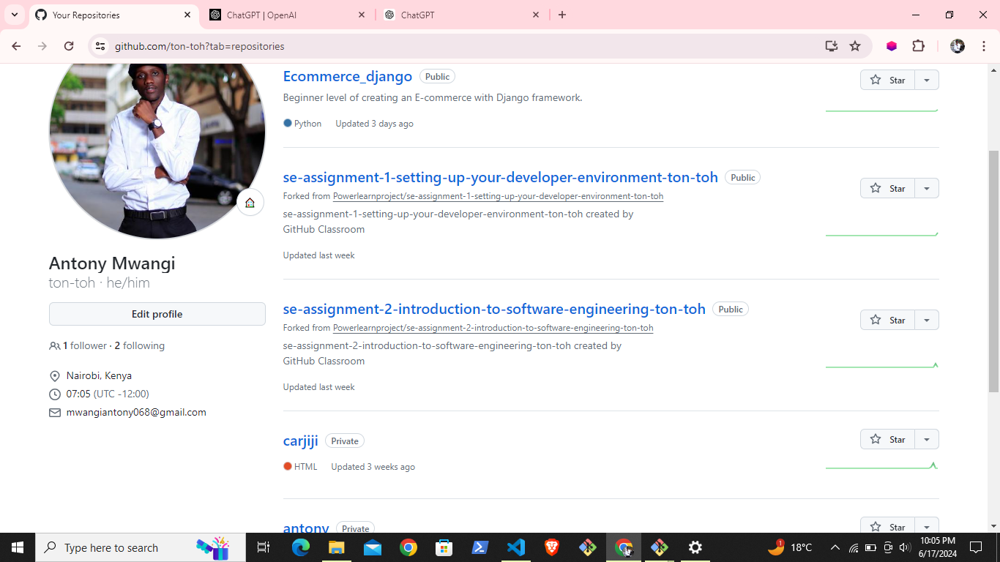

# Dev_Setup
Setup Development Environment

#Assignment: Setting Up Your Developer Environment

#Objective:
This assignment aims to familiarize you with the tools and configurations necessary to set up an efficient developer environment for software engineering projects. Completing this assignment will give you the skills required to set up a robust and productive workspace conducive to coding, debugging, version control, and collaboration.

#Tasks:

1. Select Your Operating System (OS):
   Choose an operating system that best suits your preferences and project requirements. Download and Install Windows 11. https://www.microsoft.com/software-download/windows11

     My machine is running Windows 10 pro.
     
      
2. Install a Text Editor or Integrated Development Environment (IDE):
   Select and install a text editor or IDE suitable for your programming languages and workflow. Download and Install Visual Studio Code. https://code.visualstudio.com/Download
 
 After ensuring that my machine is up and running and very ready for use for my projects, I went ahead to download and install Visual Studio Code. Settting up Visual Studio Code is relatively easy and straight forward task. It will only 
 take not more that 10 minutes to be up and running on your computer.

3. Set Up Version Control System:
   Install Git and configure it on your local machine. Create a GitHub account for hosting your repositories. Initialize a Git repository for your project and make your first commit. https://github.com

   To be able to control the version of all my projects, I downloaded the latest version of Git from the desgnated website for Git. Git can be a little more complicated to setup on the machine for it requires some additional steps such as ensuring you configure it with your GitHub account to be able to push your repositories. Creating a GitHub account is a short and a guided procedure. It is a very fascinating experience to interact with GitHub given its many and engaging features. My GitHub account is captured by the following screenshot . In the above image, there is among my first repositories for my projects. Some of them are private and some are public.

4. Install Necessary Programming Languages and Runtimes:
  Instal Python from http://wwww.python.org programming language required for your project and install their respective compilers, interpreters, or runtimes. Ensure you have the necessary tools to build and execute your code.
  
  It is highly recommended to have a good knowledge of Python Programming Language especially because of its versatility and easy to use and build adaptive softwares. To achieve this, I installed the Python from their website. To ensure that it runs in my machine, it was important to include it in my environment variables. To be able to work with Pyhton, it is highly recommended to download other runtime libraries such as Dart and flutter. These are especially useful when developing moblie applications. They are also included in the environment variables to be able to run them. 

5. Install Package Managers:
   If applicable, install package managers like pip (Python).

   Pip is the default package manager for Python therefore highly recommended to install it. It is one of the easiest downloads you will ever encounter int the development journey. If you correctly install python, the Pip package manager comes in handy. All you do is run a command: pip --version, to know the version of pip installed.

6. Configure a Database (MySQL):
   Download and install MySQL database. https://dev.mysql.com/downloads/windows/installer/5.7.html

   Among all the downloads and setups I did to get my coding environment ready, MySQL installation seemed to be a little bit challenging. I had to deal with a few problems like not understanding that MySQL path is supposed to be added to the system variables instead of user variables. I had to consult a few sources to be able to fix the issue.

7. Set Up Development Environments and Virtualization (Optional):
   Consider using virtualization tools like Docker or virtual machines to isolate project dependencies and ensure consistent environments across different machines.

8. Explore Extensions and Plugins:
   Explore available extensions, plugins, and add-ons for your chosen text editor or IDE to enhance functionality, such as syntax highlighting, linting, code formatting, and version control integration.

   Interacting with Visual code studio is a great experience only if you have several extensions installed in it. To make your code simpler and visually appealing, I considered installing  the Prettier extension. Another interesting extension is Tabnine AI extension. This extension handles issues such as autocomplete of my codes, it also suggests my next lines of my code making my coding easier and less complicated. While working on static websites, I considered installing Live Server extension developed by Ritwick Dey. This extension helps me to see any changes I make on my project without having to run a server on my command prompt. The two extensions are among the many I installed on my vs code. You should see my Visual Code Studio, its amazing. 

9. Document Your Setup:
    Create a comprehensive document outlining the steps you've taken to set up your developer environment. Include any configurations, customizations, or troubleshooting steps encountered during the process. 

#Deliverables:
- Document detailing the setup process with step-by-step instructions and screenshots where necessary.
- A GitHub repository containing a sample project initialized with Git and any necessary configuration files (e.g., .gitignore).
- A reflection on the challenges faced during setup and strategies employed to overcome them.

#Submission:
Submit your document and GitHub repository link through the designated platform or email to the instructor by the specified deadline.

#Evaluation Criteria:**
- Completeness and accuracy of setup documentation.
- Effectiveness of version control implementation.
- Appropriateness of tools selected for the project requirements.
- Clarity of reflection on challenges and solutions encountered.
- Adherence to submission guidelines and deadlines.

Note: Feel free to reach out for clarification or assistance with any aspect of the assignment.
